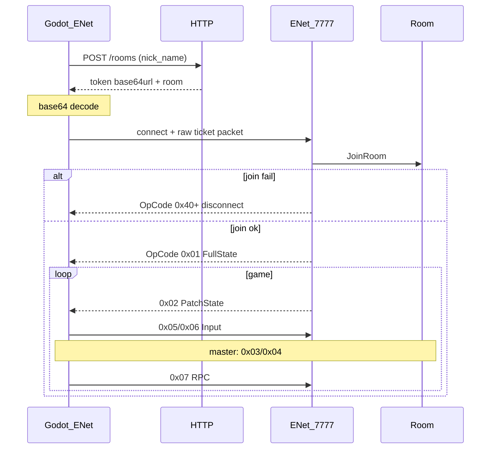

# Client protocol (Godot)

Спецификация клиентского протокола для **Godot** к сервису `z-core-frontier-rooms`.  
Цель: реализовать клиент (или сгенерировать его ИИ) **без чтения всего репозитория**.

**Основной data plane — ENet UDP.** WebSocket — только для быстрой проверки без ENet.

## Секции

| Документ | Содержание |
|----------|------------|
| [http.md](http.md) | Control plane: REST JSON, ticket, auth |
| **[enet.md](enet.md)** | **Data plane: ENet UDP (основной)** |
| [realtime.md](realtime.md) | Общий кадр; WebSocket для отладки |
| [state-sync.md](state-sync.md) | Master, ticks, кто что шлёт, Replace |
| [errors.md](errors.md) | Wire OpCode ошибок и реакция клиента |
| [../wire-state-codec.md](../wire-state-codec.md) | Бинарный layout payload (BE, maps) |

## E2e-поток (ENet)

## Чеклист реализации (Godot, ENet)

1. **HTTP** — create room с `nick_name` (хост получает ticket), issue ticket для joiners ([http.md](http.md)); API key в заголовке.
2. **Decode token** — base64url → `ticket_bytes` (`ticket_bytes[0] == 2`).
3. **ENet client** — connect `host:7777`; см. [enet.md](enet.md).
4. **Admit** — первый пакет ch0 reliable = сырые `ticket_bytes`.
5. **Frame parser** — `opcode = data[0]`, `payload = data[1:]`.
6. **Wire codec** — `0x01`/`0x02` full/patch ([wire-state-codec.md](../wire-state-codec.md)).
7. **Input** — `0x05`/`0x06`; patch можно unreliable.
8. **Master gate** — `0x03`/`0x04` только при `is_master`.
9. **Errors** — join `0x40+`/`0x70+` disconnect; in-room `0x60+` stay connected ([errors.md](errors.md)).
10. **(Опционально) WS smoke-test** — [realtime.md#websocket-отладка](realtime.md#websocket-отладка).

## Источник истины в коде (сервер)

| Тема | Файлы / тесты |
|------|----------------|
| ENet host / admit | `internal/delivery/enet/` |
| Игровые OpCode | `internal/domain/state/opcodes.go` |
| Payload codec | `internal/adapter/realtime/codec/` |
| Round-trip тесты | `tests/adapter/realtime/codec/` |
| Ошибки wire | `internal/delivery/errors/` |
| Policy (master, ticks) | `internal/adapter/realtime/policy/state/` |

При расхождении документа и кода — **код и тесты codec** приоритетнее.

## Opaque ID

`ValueId`, `ComponentID`, `EntityID` (u16, ключ map), `EntityTypeID` (`entity_type_id` u8 на wire), `RpcID` — opaque на wire. Семантику задаёт игра на клиенте.
