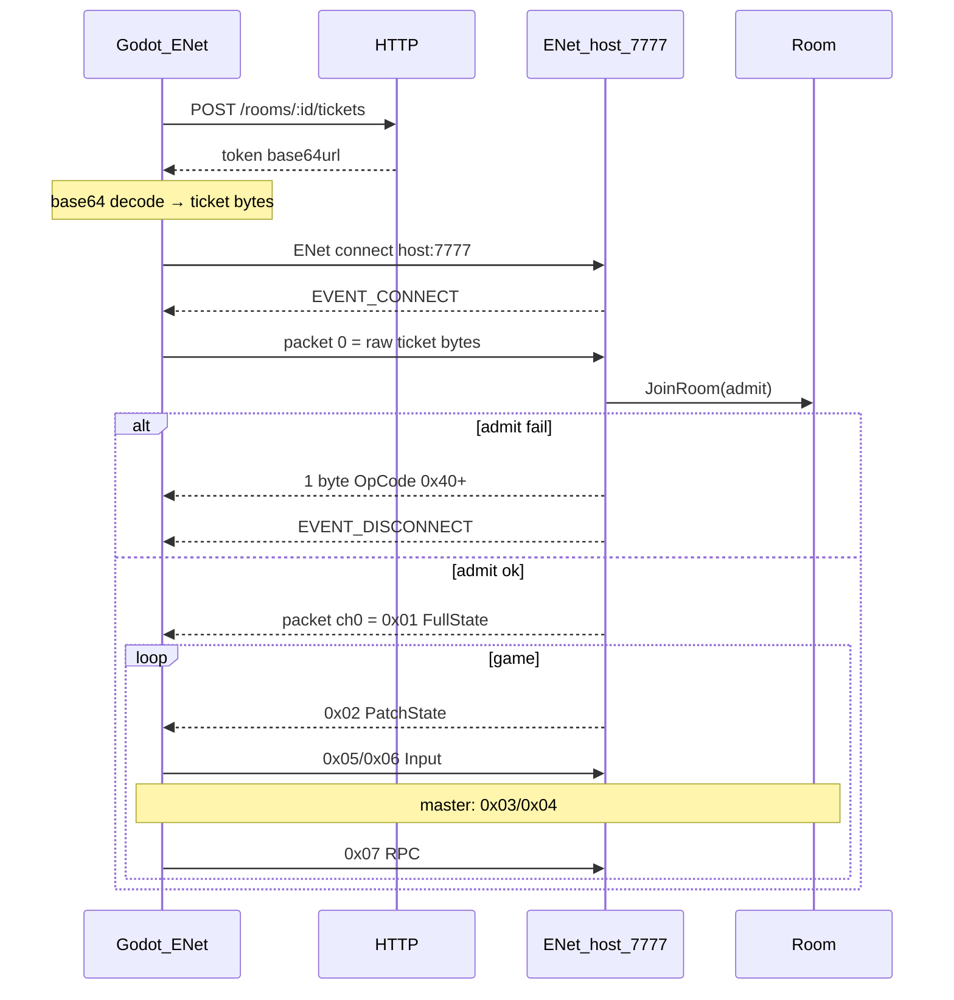

# ENet data plane (основной транспорт)

**ENet UDP** — целевой data plane для Godot-клиента.  
**WebSocket** — только для быстрой отладки без ENet-плагина: [realtime.md#websocket-отладка](realtime.md#websocket-отладка).

После [HTTP issue ticket](http.md) клиент подключается по UDP, проходит admit и обменивается теми же кадрами `OpCode + payload`, что описаны в [wire-state-codec.md](../wire-state-codec.md) и [state-sync.md](state-sync.md).

## Порты и сервер

| Параметр | Default | Примечание |
|----------|---------|------------|
| HTTP (ticket) | `:3000` | `HTTP_ADDR` |
| ENet UDP | `7777` | Отдельный слушатель, не Fiber |
| Build сервера | `-tags enet` + `CGO_ENABLED=1` | Без тега ENet host не поднимается |

```bash
CGO_ENABLED=1 go build -tags enet -o bin/rooms ./cmd/rooms
```

Параметры host (код, не env): `PeerLimit=64`, `ChannelLimit=2`, `ServiceTimeoutMs=10` — [internal/delivery/enet/config.go](../../internal/delivery/enet/config.go).

Общие лимиты транспорта (env): `TRANSPORT_MAX_INCOMING_FRAME_BYTES` (default **256 KiB**), `TRANSPORT_ENET_INCOMING_QUEUE` (default **256**) — [internal/adapter/transport/README.md](../../internal/adapter/transport/README.md).

---

## E2e-поток (ENet)



---

## Ticket: HTTP → первый UDP-пакет

1. `POST /rooms/:id/tickets` → JSON `{"token":"<base64url>"}`.
2. Клиент **декодирует** base64url (`RawURLEncoding`, без padding) → `PackedByteArray` / `[]byte` ticket v2.
3. **Первый** исходящий ENet-пакет после `EVENT_CONNECT` = **только** эти байты, **без** префикса OpCode.

Формат ticket v2:

```text
version     u8   = 2
room_id     u64 BE
peer_id     u64 BE
issued_at   u64 BE
expires_at  u64 BE
nick_len    u8
nick        UTF-8 (1…64 bytes)
hmac        32 bytes
```

Размер: `67 + len(nick)` … `130` байт. Подробнее: [internal/adapter/admission/README.md](../../internal/adapter/admission/README.md).

### Отличие от WebSocket

| Транспорт | Что передаётся при join |
|-----------|-------------------------|
| **ENet** | Сырые байты ticket (после base64 decode) |
| WebSocket | Строка base64url в query `?token=...` (decode на сервере) |

---

## Admit (первый пакет)

Сервер ждёт **первый** `EventReceive` от нового ENet-peer:

| Условие | Действие сервера |
|---------|------------------|
| Пакет пустой | Join reject `0x40` → disconnect |
| Размер > `MaxIncomingFrameBytes` | Disconnect **без** wire-кадра |
| `JoinRoom` ошибка | 1 байт OpCode `0x40+` / `0x70+` → disconnect |
| Успех | `admitted=true`; дальше только кадры `OpCode+payload` |

Отдельного success OpCode **нет**. Первый игровой пакет — `0x01` FullState (reliable, channel 0).

---

## Кадры после admit

```text
[OpCode: u8][Payload: variable]
```

| OpCode | Назначение |
|--------|------------|
| `0x01`–`0x07` | State / input / RPC |
| `0x40`–`0x5F` | Join reject (только при admit) |
| `0x60`–`0x6F` | In-room error (соединение живо) |
| `0x70`–`0x7F` | Reservation reject (при admit) |

Лимит длины пакета = `MaxIncomingFrameBytes` (OpCode + payload). Превышение → **disconnect** без wire-ошибки.

Ошибки: [errors.md](errors.md). Payload layout: [wire-state-codec.md](../wire-state-codec.md).

---

## Channel и reliable / unreliable

Сервер шлёт **всё на channel `0`** ([connection_cgo.go](../../internal/adapter/transport/enet/connection_cgo.go)).

| Направление | Reliable flag | Поведение на сервере |
|-------------|---------------|----------------------|
| Server → client | **всегда reliable** | `DeliveryDefault` → `PACKET_FLAG_RELIABLE` |
| Client → server | reliable (bit 0) | `DeliveryReliable` |
| Client → server | без флага | `DeliveryUnreliable` |

Константа ENet (стандартная, та же в go-enet / Godot): **`PACKET_FLAG_RELIABLE = 1`**.

### Рекомендации клиенту (Godot)

| Трафик | Reliable |
|--------|----------|
| Первый пакет (ticket) | **да** |
| Entities `0x03`/`0x04` (master) | **да** |
| RPC `0x07` | **да** |
| Input `0x05`/`0x06` full | **да** |
| Input patch `0x06` высокочастотный | можно **unreliable** (сервер примет; потери допустимы по игровой логике) |

WS delivery не различает — для отладки всё implicit reliable.

---

## RTT (ping)

На ENet сервер берёт `peer.GetRoundTripTime()` (мс) → поле `ping` в peer state room patch.  
Отдельного игрового ping OpCode **нет**.

---

## Disconnect и Leave

- Клиент закрыл соединение / timeout → сервер `LeaveRoom` → `Revoke` слота.
- Oversized frame / invalid frame после admit → disconnect + leave.
- Переполнение входной очереди ENet на сервере → **drop** кадра (warn в логах), соединение не рвётся.

Reconnect: новый issue ticket или Replace с тем же `peer_id` — [state-sync.md](state-sync.md).

---

## Godot: пошаговая реализация

Godot 4 встроенно использует ENet для `ENetMultiplayerPeer`, но для **кастомного** протокола нужен прямой доступ к ENet (GDExtension, модуль или обёртка над `enet.h`). Ниже — логика, совместимая с сервером.

### 1. HTTP → ticket bytes

Декодируйте `token` из JSON так же, как сервер кодирует в `tokenToResponse`: **base64.RawURLEncoding** (без `=` padding). В GDScript — своя функция или готовая URL-safe base64 decode; результат — `PackedByteArray`.

Проверка: `ticket_bytes[0] == 2` (version byte).

### 2. ENet host + connect

```text
host = enet_host_create(NULL, 1, 2, 0, 0)   # 1 peer, 2 channels — как на сервере
peer = enet_host_connect(host, address, 7777, 0)
```

В Godot-обёртке: создать client host, `connect_to_host("127.0.0.1", 7777)`.

### 3. После EVENT_CONNECT — admit

```gdscript
# channel 0, PACKET_FLAG_RELIABLE
peer.send(0, ticket_bytes, ENetPacketPeer.FLAG_RELIABLE)
```

До admit **не** слать кадры с OpCode.

### 4. Приём после admit

```gdscript
func _process(_delta):
    host.service()
    var event = host.check_events()
    while event.type != EVENT_NONE:
        if event.type == EVENT_RECEIVE:
            var data: PackedByteArray = event.packet
            if data.is_empty():
                continue
            var opcode := data[0]
            var payload := data.slice(1)
            _handle_frame(opcode, payload)
        event = host.check_events()
```

Если первый принятый кадр после connect имеет `opcode >= 0x40` и длина `1` — join failed, см. [errors.md](errors.md).

### 5. Отправка игрового кадра

```gdscript
const PACKET_FLAG_RELIABLE := 1

func send_frame(opcode: int, payload: PackedByteArray, reliable: bool = true) -> void:
    var frame := PackedByteArray([opcode])
    frame.append_array(payload)
    var flags := PACKET_FLAG_RELIABLE if reliable else 0
    peer.send(0, frame, flags)
```

Примеры:

```gdscript
send_frame(0x05, encoded_input, true)       # full input
send_frame(0x06, encoded_patch, false)      # частый patch — optional unreliable
send_frame(0x07, encoded_rpc, true)
```

### 6. Цикл игры

1. Дождаться `0x01` FullState — построить локальный room state.
2. Применять `0x02` PatchState.
3. Шлить input каждый тик / по изменению.
4. Если `is_master` — entities `0x03`/`0x04`.
5. RPC по необходимости.

---

## Чеклист ENet-клиента

1. HTTP: create room → issue ticket → decode base64url → `ticket_bytes`.
2. ENet client host, connect `host:7777`.
3. На connect: send `ticket_bytes` reliable ch0.
4. Парсер кадра `opcode + payload` на каждый `EVENT_RECEIVE`.
5. Wire codec: [wire-state-codec.md](../wire-state-codec.md).
6. State sync / master: [state-sync.md](state-sync.md).
7. Join errors → disconnect; in-room `0x60+` → лог, stay connected.
8. Channel **0**; reliable по умолчанию.
9. Не превышать 256 KiB на пакет.
10. WS — только для smoke-test ([realtime.md](realtime.md)).

---

## Серверный код (reference)

| Файл | Роль |
|------|------|
| `internal/delivery/enet/run_cgo.go` | Host loop, admit, receive |
| `internal/adapter/transport/enet/connection_cgo.go` | Send/Receive, RTT |
| `internal/delivery/enet/flags_cgo.go` | Reliable mapping |

Тесты compile (cgo): `CGO_ENABLED=1 go test -tags enet ./tests/delivery/enet/...`
